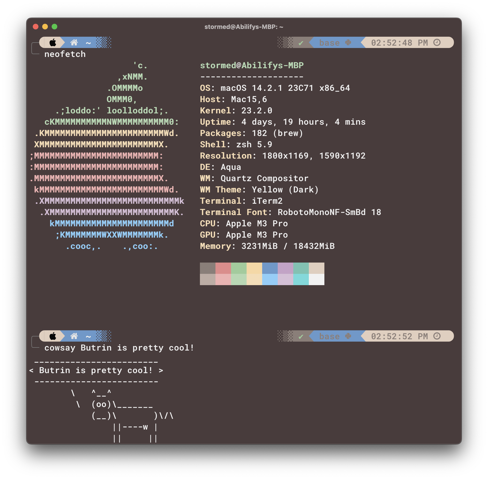

Demo
=========

## Whoa, what is this repo?
Butrin is a terminal theme that features a natural color scheme with a modern flair!
 

## Official Color Pallet

| Colors | Hex Code |
|------------|--------------|
| Background | #4b3b3c      |
| Foreground | #f2f2f2      |
| Black      | #8c7e78      |
| Red        | #E68A8A      |
| Green      | #99CC99      |
| Yellow     | #FAD7A0      |
| Blue       | #6699CC      |
| Magenta    | #C8A2C8      |
| Cyan       | #6FC3B2      |
| White      | #E2CEBE      |

| Bright Colors | Hex Code  |
|----------------|----------|
| Black   | #BFACA4  |
| Red     | #F2B1B1  |
| Green   | #B2D8B2  |
| Yellow  | #F7DCB4  |
| Blue    | #87CEFA  |
| Magenta | #D8BFD8  |
| Cyan    | #64DBDB  |
| White   | #F2F2F2  |

